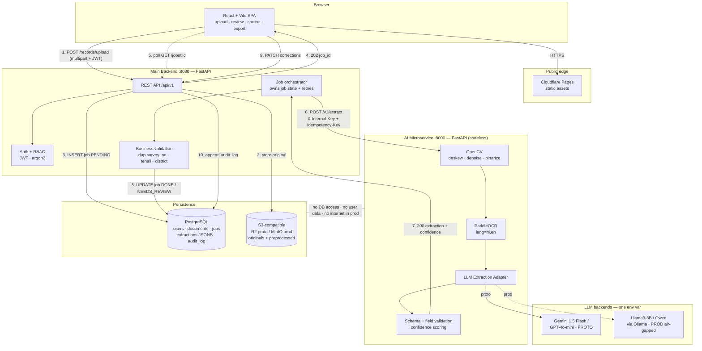

# SIH26018 — Architecture, Stack & Deployment Plan (Prompt 1 output)

> **Note:** The main backend below was originally picked as Node/Express. That was later overridden — the team decided to use **Python + FastAPI** for the main backend too (same framework as the AI microservice, one shared Pydantic schema instead of a separate TS types layer). Everything else in this document (DB, auth, storage, hosting, architecture flow, REST contract, roadmap) still stands as written; read "Node/Express" below as "Python/FastAPI" wherever it appears.

You left the prefs slot blank, so defaults were picked and each assumption worth overriding was flagged.

## 1. Stack

| Layer | Pick | Why (1 line) |
|---|---|---|
| Frontend | React 18 + Vite + TypeScript | Vite dev server is instant, and static build deploys free anywhere; no SSR need since this is an authenticated internal tool. |
| UI kit | Tailwind + shadcn/ui + TanStack Query | shadcn gives you a credible "govt dashboard" look in hours; TanStack Query handles the job-polling/retry logic you'll need for async OCR. |
| Main backend | ~~Node 20 + Express + TypeScript + Zod~~ → **Python 3.11 + FastAPI (decided)** | Keeps one language across both backend services; shared Pydantic schema replaces the original Zod/TS validation layer. |
| AI microservice | Python 3.11 + FastAPI + Uvicorn (decided) | Already locked; FastAPI's Pydantic models are the canonical definition of your output schema. |
| ORM / DB access | ~~Prisma~~ → SQLModel / SQLAlchemy 2.0 | Migrations + typed client; JSON/JSONB column stores raw extraction blobs without schema churn. |
| DB | PostgreSQL 16 on Neon (free tier) | JSONB holds the raw extraction, relational tables hold the verified record — and Neon's free tier doesn't sleep on you mid-demo like Supabase's pausing does. |
| Auth | Self-issued JWT (python-jose) + passlib[argon2] + RBAC roles `clerk / verifier / admin` | Third-party auth (Clerk, Auth0, Supabase Auth) hard-breaks the air-gap story you're selling to the judges; owning the token issuer keeps prod deployable offline. |
| File storage | S3 API — Cloudflare R2 for proto, MinIO for prod | Same SDK and same env vars for both, so storage swaps with one config change exactly like the LLM adapter does. |
| Frontend hosting | Cloudflare Pages / Vercel | Free, global, push-to-deploy. |
| Backend hosting | Render free web service | Cold-starts after 15 min idle — ping it from cron-job.org 30 min before the demo. |
| Microservice hosting | Hugging Face Spaces (Docker SDK, free CPU) | 2 vCPU / 16 GB RAM / 50 GB disk — the only free tier that actually fits PaddleOCR + model weights. Render's 512 MB free tier will OOM on first inference. |
| Observability | structlog on both services, shared `X-Request-Id` | One correlation ID across both services turns "the demo broke" into a 30-second grep. |

**Assumptions to override if wrong:** no Redis/queue (added complexity you don't need at demo scale — the job table in Postgres is your queue).

## 2. Architecture



## 3. REST contract

### 3.1 Main backend → microservice (internal, the part that matters)

Auth: `X-Internal-Key: <shared secret>` in proto; mTLS + private network in prod. The microservice **never** sees a user JWT.

#### `POST /v1/extract`

```
Content-Type: multipart/form-data
X-Internal-Key: <secret>
X-Request-Id: 8f3c...          # propagated from the user request
Idempotency-Key: <job_id>      # safe retry on timeout
```

| Field | Type | Notes |
|---|---|---|
| `file` | binary | jpeg/png/tiff/pdf, ≤ 15 MB |
| `doc_type` | string | `land_record` \| `mutation_order` (routes the prompt template) |
| `lang_hint` | string | default `hi,en` |
| `return_preprocessed` | bool | default `false`; `true` returns a base64 deskewed image for the review UI |

**200 OK** — the happy path *and* the low-confidence path:

```json
{
  "request_id": "8f3c...",
  "status": "ok",
  "processing_ms": 11840,
  "engine": {
    "ocr": "paddleocr-2.7.3",
    "llm": "gemini-1.5-flash-002",
    "mode": "cloud",
    "schema_version": "1.0.0"
  },
  "extraction": {
    "location_details": { "village": "Rampur", "tehsil": "Sadar", "district": "Varanasi" },
    "land_identifiers": { "survey_number": "142/2", "khasra_number": "1187", "khata_number": "00214" },
    "land_details": { "plot_area": "0.486 hectare", "land_classification": "Irrigated / Sinchit" },
    "ownership_details": {
      "landowner_name": "Ram Prasad Yadav",
      "registration_information": "Reg. No. 4417, dated 12-03-1998, SRO Varanasi",
      "mutation_records": "Mutation 221/2011 dated 04-07-2011"
    },
    "confidence_scores": {
      "overall_confidence": 0.63,
      "flagged_fields": [
        { "field": "land_identifiers.khata_number", "confidence": 0.41, "reason": "low_ocr_confidence" },
        { "field": "land_details.plot_area", "confidence": 0.55, "reason": "unit_ambiguous" }
      ]
    }
  },
  "raw_ocr": { "text": "…", "mean_ocr_confidence": 0.79, "page_count": 1 },
  "preprocessed_image_b64": null
}
```

**Design decision worth defending to judges:** low confidence is **not** an HTTP error. `status` is `ok` when `overall_confidence ≥ 0.75` and no field is flagged, `needs_review` otherwise — same 200, same body shape. A non-2xx for "I read it but I'm unsure" would make every client re-implement the same branching. `flagged_fields` is always present; empty array means clean.

`reason` enum: `low_ocr_confidence` | `field_missing` | `unit_ambiguous` | `regex_mismatch` | `llm_uncertain` | `multi_candidate`.

#### Error responses (uniform envelope)

```json
{ "request_id": "8f3c...", "error": { "code": "OCR_NO_TEXT", "message": "No text regions detected after preprocessing.", "retryable": false } }
```

| Status | `code` | When | Backend action |
|---|---|---|---|
| 400 | `BAD_REQUEST` | missing `file`, bad `doc_type` | fail job, surface to user |
| 401 | `UNAUTHORIZED` | bad/absent `X-Internal-Key` | alert — never surface |
| 413 | `FILE_TOO_LARGE` | > 15 MB | fail job, ask user to recompress |
| 415 | `UNSUPPORTED_MEDIA_TYPE` | not an accepted mime | fail job |
| 422 | `OCR_NO_TEXT` / `IMAGE_UNREADABLE` | blank, black, or < 40 px text height | mark `FAILED_UNREADABLE`, prompt re-scan |
| 429 | `LLM_RATE_LIMITED` | upstream 429 | retry w/ jitter, max 3 (`Retry-After` honoured) |
| 502 | `LLM_UPSTREAM_ERROR` | provider 5xx / malformed JSON after 2 re-asks | retry once, then `FAILED` |
| 503 | `MODEL_LOADING` | cold start, weights not resident | retry after 10 s, max 6 |
| 504 | `PROCESSING_TIMEOUT` | > 90 s internal budget | fail job, keep original in S3 |

Plus `GET /health` (liveness, no model touch) and `GET /v1/meta` → `{ocr_version, llm_model, mode, schema_version, max_file_mb}` — the frontend shows `mode: cloud|local` as a badge, which sells the air-gap story visually during the demo.

### 3.2 Frontend → main backend

| Method | Path | Returns |
|---|---|---|
| `POST` | `/api/v1/records/upload` | `202` `{job_id, status:"PENDING", poll_after_ms:3000}` |
| `GET` | `/api/v1/jobs/:job_id` | `200` `{status: PENDING\|PROCESSING\|NEEDS_REVIEW\|DONE\|FAILED, progress, extraction?, error?}` |
| `GET` | `/api/v1/records?flagged=true&district=` | paginated list for the verification queue |
| `PATCH` | `/api/v1/records/:id` | `200` — human correction; body is a partial extraction, writes `audit_log(user, field, old, new, ts)` |
| `POST` | `/api/v1/records/:id/verify` | `200` — `verifier` role only, locks the record |
| `GET` | `/api/v1/records/:id/export?format=json\|csv` | signed download |

Poll, don't WebSocket: free-tier hosts drop idle sockets, and a 3 s poll survives a flaky venue Wi-Fi demo.

## 4. Repo structure

Both backend services are FastAPI now, so the schema-drift problem below is easier than described — instead of `packages/schema` generating both TS types and Pydantic models, the main backend and AI microservice can import the **same Pydantic package** directly. The rest of the structure (frontend app, infra, samples, docs) stays as designed.

```
sih26018/
├── apps/
│   ├── web/                       # React + Vite
│   │   └── src/{pages,components,hooks,api,lib}
│   │       └── pages/{Upload,ReviewQueue,RecordDetail,Login}.tsx
│   ├── api/                       # Main backend — FastAPI
│   │   └── app/
│   │       ├── main.py
│   │       ├── routes/{records.py,jobs.py,auth.py,export.py}
│   │       ├── services/{ai_client.py,storage.py,job_runner.py}
│   │       ├── middleware/{auth.py,rbac.py,request_id.py,error_handler.py}
│   │       ├── validation/business_rules.py
│   │       └── models/ (SQLModel/SQLAlchemy) + migrations/
│   └── ai-service/                # AI microservice — FastAPI
│       └── app/
│           ├── main.py            # routes only
│           ├── config.py          # env: LLM_PROVIDER, LLM_MODEL, LLM_BASE_URL
│           ├── schemas/extraction.py   # Pydantic = source of truth, shared with apps/api
│           ├── pipeline/
│           │   ├── preprocess.py  # deskew, denoise, CLAHE, binarize
│           │   ├── ocr.py         # PaddleOCR singleton, warm on startup
│           │   ├── postprocess.py # devanagari numeral normalisation
│           │   └── confidence.py  # OCR conf × LLM conf × rule hits
│           ├── adapters/
│           │   ├── base.py        # class LLMAdapter(ABC): extract(text, doc_type)
│           │   ├── gemini.py
│           │   ├── openai.py
│           │   ├── ollama.py      # local Llama3-8B / Qwen
│           │   └── factory.py     # get_adapter() reads LLM_PROVIDER
│           ├── prompts/{land_record_v1.md,mutation_order_v1.md}
│           └── validators/{field_rules.py,unit_parser.py}
├── packages/
│   └── schema/                    # Shared Pydantic extraction schema, imported by both apps/api and apps/ai-service
├── infra/
│   ├── docker-compose.yml         # postgres + minio + api + ai-service
│   └── Dockerfile.{api,ai}
├── samples/                       # 20-30 anonymised/synthetic land records — commit these
└── docs/{ARCHITECTURE.md,API.md,DEMO_SCRIPT.md}
```

One schema edit propagates to both backend services automatically — this is the single highest-leverage thing in the repo.

## 5. Prototype vs production security delta

**Prototype (cloud LLM):** raw OCR text of citizen land records leaves the perimeter to a third-party API — that is unredacted PII (owner names, holdings, registration numbers) crossing a jurisdictional boundary, which no revenue department will sign off on. Mitigate visibly in the demo: TLS in transit, API keys in env/secret manager only, redact owner names before the LLM call where the prompt permits, log prompts with hashes not raw text, zero-retention provider settings, and a documented DPDP Act 2023 gap in the README.

**Production (air-gapped local LLM):** flip `LLM_PROVIDER=ollama` and the AI microservice needs no egress at all — drop it in a VPC with an egress-deny rule, mTLS from the main backend, S3 swapped to on-prem MinIO, weights baked into the image. The security boundary is then purely physical, and PII never crosses it.

**The delta is one env var, not one rewrite** — which is precisely what the adapter pattern buys you, and it's the sentence to say out loud to the judges. Remaining prod hardening beyond the swap: per-user rate limits, S3 SSE-at-rest, signed time-boxed URLs, and an immutable `audit_log` on every field mutation.

## 6. Six-day roadmap

| Day | Milestone | "Done" means |
|---|---|---|
| **1** | Skeleton + contract frozen | Monorepo scaffolded, `docker compose up` brings up Postgres + MinIO + both services, shared Pydantic schema package written, `/health` + `/v1/meta` green. **`POST /v1/extract` returns a hardcoded fixture** — frontend is now unblocked and never waits on the AI team again. |
| **2** | OCR path real | OpenCV preprocessing + PaddleOCR running on 20 sample images; raw text dumped to disk; baseline character accuracy measured on Hindi and English separately. Auth (register/login/JWT/RBAC) done in parallel on the backend. |
| **3** | Extraction real | Gemini/GPT adapter + `land_record_v1` prompt returning schema-valid JSON, with one automatic re-ask on parse failure. Confidence scoring wired (OCR conf × LLM self-report × rule hits). Fixture swapped for the live call. |
| **4** | End-to-end vertical slice | Upload → S3 → job row → microservice → extraction persisted → frontend poll renders the record. Ugly but *complete*. This is the "we have a working system" checkpoint — if you're behind, cut scope here, not later. |
| **5** | The differentiator: review UI | Side-by-side scan/preprocessed image vs editable fields, flagged fields highlighted amber with the `reason`, inline correction → `PATCH` → audit log, verifier queue filtered by confidence. **This is what wins the demo**, not the OCR. |
| **6** | Local LLM + hardening | Ollama adapter proven on Llama3-8B locally (even if not deployed), `mode` badge in the UI, export to CSV/JSON, error states for every code in §3.1, seed data, deploy all three to free tiers, cron pinger on Render. |
| **7 (buffer)** | Rehearse | `DEMO_SCRIPT.md`, a **pre-recorded 90-second video fallback** in case venue Wi-Fi dies, 3 known-good sample images bookmarked, architecture slide, and one deliberately bad scan to show the low-confidence flow — judges remember the failure handling. |

Two things to protect: freeze the JSON schema on day 1 and change it only through the shared `packages/schema`; and keep day 4's vertical slice sacred — teams lose SIH by having three excellent disconnected components on demo morning.
